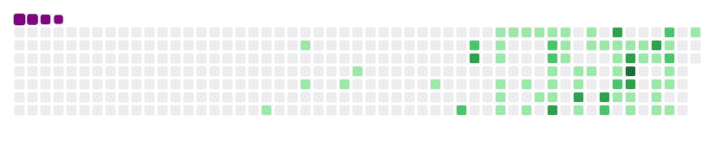

# Hey, I am Raman! Great to see you here! 

I am Raman Boddula, i have completed my Bachelor's of engineering in Computer Science and Business Systems from [Osmania University](https://www.osmania.ac.in/). I am a  aspriring full stack web developer I am always open to collaborating on projects and innovative / disruptive ideas. When I am not coding, you'll find me in playing games or in my kitchen cooking the food .

Find out more about me & feel free to connect with me here:

	
	
	
	
  
  

---

---

## ⚡ Tech Stack

### 🚀 Languages

### 💻 Libraries & Framework

<!-- 
 -->

<!--  -->

### 🧑🏻‍💻 Tools & Platform

## 📈 Stats

  
  

---

   

